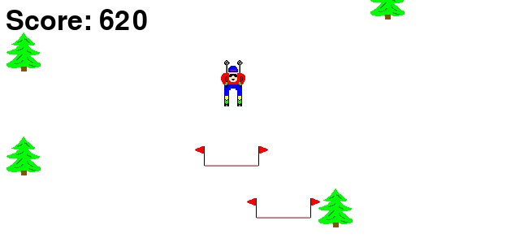

<p align="center">
  
</p>

# Skier Game Like Gym
This game can be controlled by another program or by a keyboard.

**OBS:** The game never ends, so feel free to play forever :D

## Prerequisites

### Python and Libraries
* Python v3.9.6
* Pygame v2.0.1

## How to play using keyboard
You can run "main.py" and play using the following keys:
* Left arrow
* Right arrow
* ESC - To close the game

## How to play using another program
To import and send commands to the game, you can uso the following code:
````
from Skier_Game.Skier import Game
skier = Game()
skier.start(keyboard_game=False, increase_speed=1, low_speed=15, max_speed=25)
while True:
    skier.step(0) # Use the action
````
In the parameter of "skier.step()" you pass the action you want to perform in the game.

### Actions
Actions you can send to the program:
* 0 - Straight
* 1 - Left
* 2 - Right

## Customizations
When start the game you can do some customizations listed below:
* **keyboard_game** - Play using keyboard or sending commands (by another program)
* **increase_speed** - How much speed will increase with each flag taken (point)
* **low_speed** - Minimum speed allowed (when starting the game and when hitting a tree)
* **max_speed** - Maximum speed allowed

## Authors

### Created by
* **Warren A. Kalolo** - [SentinelWarren](https://github.com/SentinelWarren)

### Changed by

* **Maxwell F. Barbosa** - [MaxwellFB](https://github.com/MaxwellFB)
